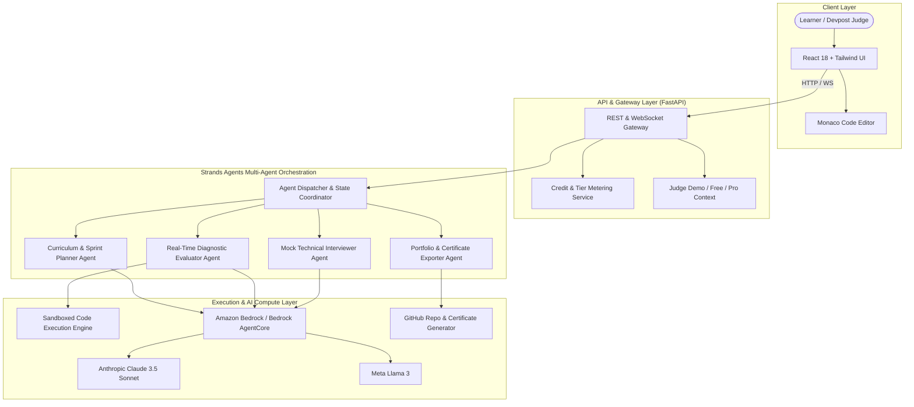

# Reveluation AI — System Architecture Specification

## Overview

**Reveluation AI** is an autonomous multi-agent platform designed to eliminate passive learning by transforming user goals into active, evaluated, and verified skill mastery.

---

## 1. High-Level Architecture

---

## 2. Multi-Agent System Design (Strands Agents SDK)

### A. Curriculum & Sprint Planner Agent
- **Role:** Analyzes user learning objectives, ingested syllabi, or career goals.
- **Output:** Generates a directed acyclic graph (DAG) of learning milestones, runnable coding exercises, test specifications, and starter boilerplate code.
- **Model:** `anthropic.claude-3-5-sonnet` on Amazon Bedrock.

### B. Real-Time Diagnostic Evaluator Agent
- **Role:** Evaluates learner-submitted code or answers against hidden unit tests.
- **Workflow:**
  1. Invokes the `CodeSandbox` tool.
  2. Parses stdout, stderr, execution duration, and assertion failures.
  3. Synthesizes an interactive diagnostic breakdown highlighting algorithmic bottlenecks, edge cases, and conceptual hints.
- **Special Capability:** Triggers dynamic self-healing remediation if repeat failures occur on fundamental topics.

### C. Portfolio & Credential Generator Agent
- **Role:** Bundles completed exercises into production-ready software repositories.
- **Artifacts Created:**
  - Multi-file code repository with tests and `README.md`.
  - Cryptographically signed / timestamped Digital Certificate of Competency.

### D. Mock Technical Interviewer Agent
- **Role:** Conducts interactive Socratic interviews on completed code to ensure deep retention and interview readiness.

---

## 3. Sandboxed Execution Engine

The code runner operates in an isolated environment with:
- Execution timeout protection (default 5.0s).
- Stdout / Stderr capture.
- Memory and process boundary controls.
- Support for Python 3 and JavaScript runtime environments.

---

## 4. Monetization & Metering Engine

- **Free Tier:** 100 credits included; 10 credits per lab generation / evaluation.
- **Pro Tier ($19/mo):** Unlimited generations, instant GitHub export, Mock Interviewer agent.
- **Judge Review Mode:** Bypasses credit quotas for frictionless hackathon evaluation.
