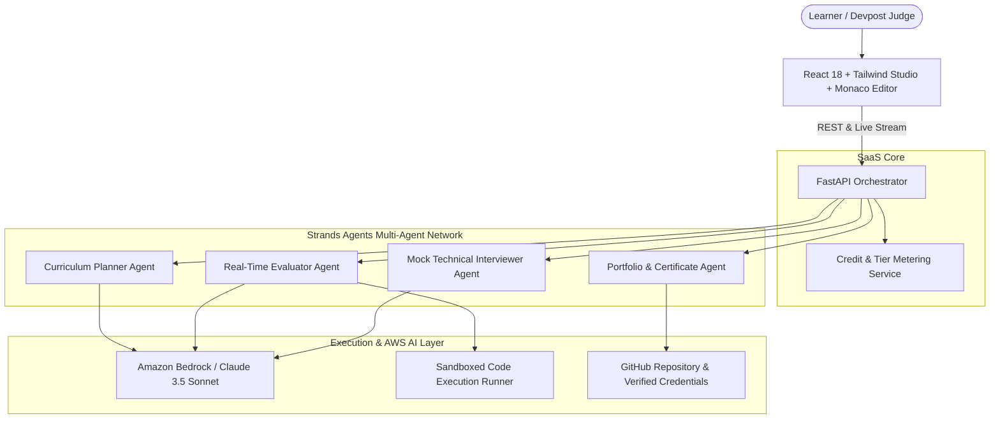

# 🌟 Reveluation AI
### *The Universal Autonomous Learning & Real-Time Evaluation Engine*

[](https://opensource.org/licenses/MIT)
[](https://aws.amazon.com/bedrock/)
[](https://strandsagents.com)
[](https://fastapi.tiangolo.com)
[](https://reactjs.org)

> **Built for the AWS Agents for Humans Hackathon 2026**  
> *Track: Everyday Agents & Professional Agents*

---

## 📌 Pitch & Hackathon Mandatory Submission Details

### 1. The Problem We're Solving
80% of self-learners and upskilling developers get trapped in **"Tutorial Hell"** — passively watching videos and reading documentation without building verifiable real-world skills. Existing AI tutors are purely conversational chatbots: they answer questions in isolation, but **cannot execute code, run automated tests, adapt curriculums based on diagnostic errors, or build deployable portfolio proof-of-work.**

### 2. Who It's For (Target Audience)
- **Self-Taught Learners & Career Switchers:** Transitioning into cloud engineering, AI, or software development without access to expensive \$15,000 bootcamps.
- **STEM & College Students:** Needing hands-on, interactive practical labs and instant feedback on coding assignments.
- **Upskilling Professionals:** Needing to rapidly master new technologies (e.g. AWS Bedrock AgentCore, Python Async, Strands Agents) through realistic, verifiable projects.

### 3. Why It Matters
Reveluation AI transforms AI education from *passive conversational Q&A* to *active end-to-end execution*:
- **Autonomous Lab Generation:** Turns any goal or syllabus into runnable coding exercises with hidden test suites.
- **Sandboxed Execution & Diagnostics:** Executes learner code in an isolated runtime and diagnoses stack traces.
- **Self-Healing Adaptive Curriculum:** Dynamically rewires the learning path when persistent conceptual gaps are detected.
- **Automated Portfolio & Credential Dispatch:** Packages completed work into a structured GitHub repository and issues a verified Certificate of Competency.

---

## 🏛️ System Architecture



---

## ✨ Key Features

1. **Autonomous Curriculum & Sprint Planner:** Enter any learning goal (e.g. *"Master AWS Bedrock AgentCore and Python Async in 7 Days"*) or upload a syllabus. The agent plans a structured, multi-milestone roadmap.
2. **Interactive Monaco Code Studio:** Full-featured developer environment with syntax highlighting, live execution, and multi-file capabilities.
3. **Real-Time Evaluator Agent:** Executes solutions against test suites, analyzes execution time and memory traces, and generates constructive hints without spoiling answers.
4. **Autonomous GitHub Portfolio Generator:** 1-click export that scaffolds a multi-file GitHub repository with passing unit tests and an automated `README.md`.
5. **AI Mock Technical Interviewer:** Conducts a live Socratic technical interview on your solved code to test conceptual retention.
6. **Monetizable SaaS Architecture:** Built-in Token & Credit metering (Free Starter tier vs. \$19/mo Pro Career Accelerator) with a dedicated **"Judge Demo Mode"** toggle for hackathon evaluators.

---

## 🛠️ Tech Stack & AWS Services

- **Agent Framework:** [Strands Agents SDK](https://strandsagents.com)
- **Foundation Models:** **Amazon Bedrock** (`anthropic.claude-3-5-sonnet`, `meta.llama3`)
- **Backend:** Python 3.10+, FastAPI, Uvicorn, Pydantic, Boto3
- **Frontend:** React 18, Vite, Tailwind CSS, Monaco Editor (`@monaco-editor/react`), Lucide Icons
- **Deployment Ready:** AWS App Runner, Amazon S3 + CloudFront, AWS Bedrock AgentCore

---

## 🚀 Quick Start & Judge Evaluation Guide

### Prerequisites
- Python 3.10+
- Node.js 18+ and npm

### 1. Backend Setup
```bash
cd backend
python -m pip install -r requirements.txt
python main.py
```
*The backend will start at `http://localhost:8000`.*

### 2. Frontend Setup
```bash
cd frontend
npm install
npm run dev
```
*The web UI will be available at `http://localhost:5173`.*

---

## 🎯 60-Second Judge Verification Walkthrough

To test the entire agentic loop end-to-end:

1. **Test Autonomous Curriculum Planning:**
   - Click **"Switch Goal / Track"** $\to$ Select the preset *"AWS Bedrock AgentCore & Strands Orchestrator"*.
   - Watch the **Curriculum Planner Agent** dynamically generate milestones and runnable coding labs.
2. **Test Sandboxed Execution & Diagnostics:**
   - Select **Lab 1.1: Building a Tool-Calling Strands Agent**.
   - Click **"Run & Test Solution"** with empty or incomplete code.
   - Observe the **Diagnostic Evaluator Agent** capture the error in the sandbox, isolate the stack trace, and inject guided hints in the *AI Diagnostics* tab.
3. **Test Verified 100% Mastery & Confetti:**
   - Paste the passing solution:
     ```python
     def agent_tool_calculator(operation: str, a: float, b: float) -> dict:
         if operation == 'add': return {'result': a + b}
         if operation == 'subtract': return {'result': a - b}
         if operation == 'multiply': return {'result': a * b}
         if operation == 'divide':
             if b == 0: return {'error': 'Zero division'}
             return {'result': a / b}
         return {'error': 'Unsupported operation'}
     ```
   - Click **"Run & Test Solution"** $\to$ Watch test cases pass with celebration confetti!
4. **Test AI Mock Technical Interviewer:**
   - Click **"Conduct AI Mock Tech Interview on this Code"** $\to$ Answer the Principal Architect's question on Big-O and AWS scalability.
5. **Test Autonomous GitHub Portfolio & Certificate Generation:**
   - Click **"Portfolio & Cert"** in the top navigation $\to$ Click **"Generate GitHub Repository & Certificate"** $\to$ Inspect the generated repository file tree and verifiable digital credential.
6. **Test SaaS Monetization & Metering:**
   - Click **"Upgrade Pro"** $\to$ View the Freemium vs. Pro Career Accelerator (\$19/mo) tier comparison $\to$ Click **"Upgrade to Pro"**.
   - Toggle **"Judge Mode"** in the header to observe unrestricted hackathon evaluation.

---

## 💎 Monetization & Business Model

| Feature | Free Starter Tier (100 Credits) | Pro Career Accelerator ($19/mo) |
| :--- | :---: | :---: |
| **Interactive Labs** | 3 Labs / Month | Unlimited |
| **Code Sandbox Runner** | Standard Speed | High-Speed Cloud Compute |
| **Diagnostic Evaluator** | Basic Hints | Deep Line-by-Line Analysis |
| **GitHub Repo Export** | ❌ | ✅ 1-Click Dispatch |
| **AI Mock Interviewer** | ❌ | ✅ Full Interactive Voice/Text |
| **Verified Skill Certificate**| ❌ | ✅ Downloadable Verified Credential |

---

## 📄 License
This project is licensed under the **MIT License** — see the [LICENSE](LICENSE) file for details.
